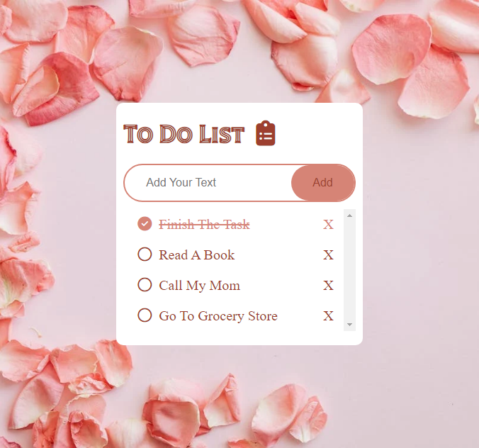

# To-Do List

This is a simple to-do list application built using HTML, CSS, and JavaScript. The application allows users to add tasks, mark them as completed, and remove tasks. The list has a maximum height of 400px, after which it enables scrolling to accommodate more tasks.

## Features

- Add tasks: Enter a task in the input box and click the "Add" button to add it to the list.
- Mark as completed: Click on a task to mark it as completed. The task will be crossed out and the circle icon will change to a checkmark.
- Remove tasks: Click on the "X" button next to a task to remove it from the list.

## Usage

To use the application, simply open the `index.html` file in a web browser. Enter tasks in the input box, click "Add" to add them to the list, and interact with the tasks as described above.

Feel free to customize the styles in the `styles.css` file to match your preferences.

## Contributions

Contributions, bug reports, and feature requests are welcome! Please fork the repository and submit a pull request.

